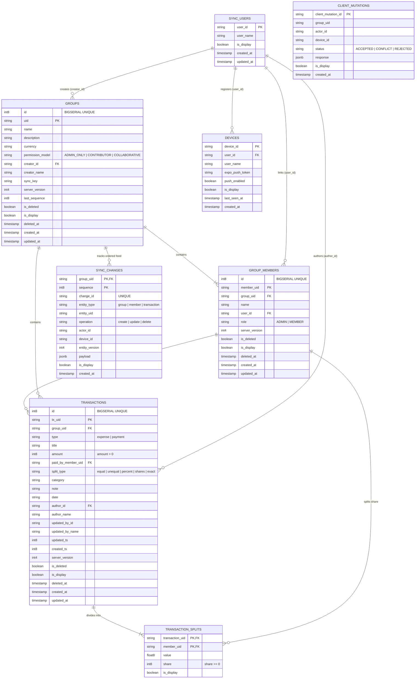

# SplitMate Database Architecture & Entity Relationship Diagram (ERD)

This document details the database schema, entity relationships, constraints, indexes, visibility cascading, and migration lifecycle for SplitMate.

---

## 1. Entity-Relationship Diagram (ERD)

The interactive diagram below models all primary database tables, relational foreign keys, cardinality, and constraints. You can view, inspect, and zoom into this diagram:



---

## 2. Table Specifications & Constraints

### 2.1 `groups`
The parent container for all collaborative ledgers.
- **`uid`** (`TEXT PRIMARY KEY`): Client-generated deterministic group UUID.
- **`permission_model`** (`TEXT NOT NULL CHECK (permission_model IN ('ADMIN_ONLY', 'CONTRIBUTOR', 'COLLABORATIVE'))`): Access control model enforced on mutations.
- **`last_sequence`** (`BIGINT NOT NULL DEFAULT 0`): Gapless monotonically increasing sequence counter incremented under exclusive row lock on push.
- **`server_version`** (`INTEGER NOT NULL DEFAULT 1`): Increments upon group metadata updates.
- **`is_display`** (`BOOLEAN NOT NULL DEFAULT true`): Row visibility flag. When `false`, returns `404 GROUP_UNAVAILABLE` rather than `GROUP_NOT_FOUND`.

### 2.2 `group_members`
Members linked to groups.
- **`member_uid`** (`TEXT PRIMARY KEY`): Member UUID.
- **`group_uid`** (`TEXT REFERENCES groups(uid)`): Foreign key to the parent group.
- **`name`** (`TEXT NOT NULL`): Unique member name within the group (enforces duplicate prevention).
- **`role`** (`TEXT NOT NULL DEFAULT 'MEMBER'`): Admin or member.
- **`is_deleted`** (`BOOLEAN NOT NULL DEFAULT false`): Soft-delete flag (tombstone).

### 2.3 `transactions`
Financial entries (expenses and payments).
- **`tx_uid`** (`TEXT PRIMARY KEY`): Client-generated transaction UUID.
- **`group_uid`** (`TEXT REFERENCES groups(uid)`): Parent group identifier.
- **`amount`** (`BIGINT NOT NULL CHECK (amount > 0)`): Positive integer cents (sub-unit). Ensures absolute currency precision.
- **`paid_by_member_uid`** (`TEXT REFERENCES group_members(member_uid)`): The paying member.
- **`split_type`** (`CHECK (split_type IN ('equal', 'unequal', 'percent', 'shares', 'exact', 'percentage'))`): Strategy for splitting.
- **`created_ts`** (`BIGINT`): Client creation epoch timestamp in milliseconds, immutable across edits to guarantee identical sorting across devices.
- **`updated_ts`** (`BIGINT`): Timestamp of the last mutation.

### 2.4 `transaction_splits`
Individual portions of a transaction.
- **Composite Primary Key**: `(transaction_uid, member_uid)`.
- **`share`** (`BIGINT NOT NULL CHECK (share >= 0)`): Share in cents allocated to the member.
- **Financial Rule**: `sum(share)` must equal `transactions.amount` strictly, or the mutation is rejected with `SPLIT_TOTAL_MISMATCH`.

### 2.5 `sync_changes`
Monotonic change log for delta pulls.
- **Composite Primary Key**: `(group_uid, sequence)`.
- **`change_id`** (`TEXT NOT NULL UNIQUE`): Unique mutation change identifier.
- **`sequence`** (`BIGINT NOT NULL`): Gapless sequence number.
- **`payload`** (`JSONB` in Postgres, `TEXT` in SQLite): Full serialized entity state at the point of change.

### 2.6 `client_mutations`
Idempotency ledger for retry deduplication.
- **`client_mutation_id`** (`TEXT PRIMARY KEY`): Unique mutation key generated by the client outbox.
- **`status`** (`TEXT CHECK (status IN ('ACCEPTED', 'CONFLICT', 'REJECTED'))`): Caches exact response to ensure replayed attempts return identical outcomes.

---

## 3. Visibility Architecture (`is_display`)

To support compliance and moderation without violating offline-first replication integrity, every table incorporates an `is_display` boolean column.

Visibility cascades via SQL views:
1. **`visible_groups`**: Excludes hidden groups and groups authored by hidden users.
2. **`visible_members`**: Cascades from visible groups and visible users.
3. **`visible_transactions`**: Excludes transactions where the author, payer, or any member in its splits is hidden.
4. **`visible_splits`**: Only exposed if the parent transaction is visible.
5. **`visible_changes`**: Hides individual change payloads while allowing the cursor to advance past the sequence index.

---

## 4. Migration Execution

SplitMate automatically executes and verifies database migrations during application startup:
- **SQLite**: Runs [001_init_sqlite.sql](file:///C:/Users/Ramzan/.gemini/antigravity/worktrees/splitmate-app/cleanup_and_dockerize_app/backend/migrations/001_init_sqlite.sql) via `aiosqlite.executescript`.
- **PostgreSQL**: Runs [001_init_postgres.sql](file:///C:/Users/Ramzan/.gemini/antigravity/worktrees/splitmate-app/cleanup_and_dockerize_app/backend/migrations/001_init_postgres.sql) via asyncpg connection pool.

To test or verify migrations independently:
```bash
# Verify SQLite migrations
python -c "import asyncio, os, sys; sys.path.insert(0, 'backend'); from app.db import Database; asyncio.run(Database('sqlite+aiosqlite:///./test.db').connect())"
```
